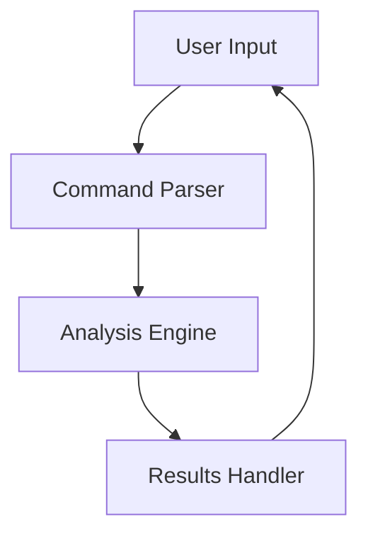

# Sortd: Intelligent File Organization Service

## Overview
Sortd is an intelligent file organization service that uses deep content analysis, multimodal understanding, and learned patterns to accurately categorize and organize files. It provides a friendly, efficient terminal user interface that scales from simple to advanced usage patterns.

## Core Components

### 1. Analysis Engine
- File signature detection
- Content analysis
- Multimodal understanding (text + images)
- Metadata extraction
- Project context detection

### 2. Organization Engine
- Pattern matching
- Rule application
- File operations
- Safety mechanisms

### 3. Learning System
- Pattern recognition
- User behavior analysis
- Feedback incorporation
- Rule refinement

### 4. Terminal User Interface
- Bubble Tea based interface
- Progressive disclosure
- Power user features
- Interactive wizards

## Directory Structure
```
sortd/
├── cmd/                    # Command-line entry points
│   ├── sortd/             # Main application
│   └── sortctl/           # Control utility
├── internal/              # Private application code
│   ├── analysis/          # Analysis engine
│   ├── organize/          # Organization engine
│   ├── learn/             # Learning system
│   ├── store/             # Data storage
│   └── config/            # Configuration
├── pkg/                   # Public packages
│   ├── patterns/          # Pattern matching
│   ├── rules/             # Rule definitions
│   └── types/             # Common types
└── ui/                    # User interface
    ├── components/        # UI components
    ├── styles/            # Lipgloss styles
    └── views/             # Screen views
```

## Key Design Principles

1. **User-Centric Design**
   - Friendly, approachable interface
   - Clear feedback and guidance
   - Progressive complexity

2. **Intelligent Processing**
   - Deep content understanding
   - Context awareness
   - Learning from user behavior

3. **Safety First**
   - Preview before action
   - Easy undo/redo
   - Clear logging

4. **Extensibility**
   - Modular architecture
   - Plugin system
   - Custom rule support

## Contextual Diagram
To illustrate the overall interactions between user commands, the interface, and the analysis engine, we introduce the following diagram:



> Note: This diagram outlines the primary system flow. It sets the context for our unit test first approach, where each component is expected to meet the behaviors depicted here.
