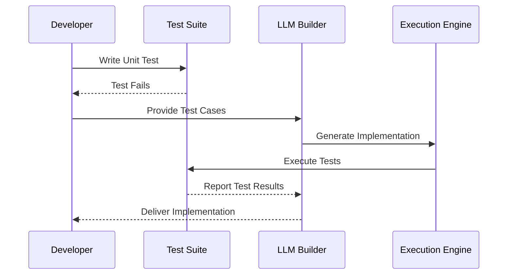

# Analysis Engine Specification

## Overview
The analysis engine is responsible for understanding files through multiple layers of inspection, from basic signature detection to deep content analysis.

## Components

### 1. File Inspector
```go
type FileInspector interface {
    // Core inspection methods
    Inspect(path string) (FileInfo, error)
    InspectBatch(paths []string) ([]FileInfo, error)
    
    // Specific inspection methods
    GetSignature(path string) ([]byte, error)
    GetMetadata(path string) (Metadata, error)
    SampleContent(path string, size int) ([]byte, error)
}

type FileInfo struct {
    Path        string
    Signature   []byte
    Type        FileType
    Metadata    Metadata
    Content     *ContentSample
    Confidence  float64
}
```

### 2. Content Analyzer
```go
type ContentAnalyzer interface {
    // Content analysis methods
    AnalyzeContent(sample []byte) (Analysis, error)
    AnalyzeImage(path string) (ImageAnalysis, error)
    ExtractText(path string) (string, error)
    
    // Pattern matching
    MatchPatterns(content []byte, patterns []Pattern) []Match
    GetTopics(content []byte) ([]Topic, float64)
}

type Analysis struct {
    ContentType     string
    Topics         []Topic
    Keywords       []string
    Patterns       []Match
    Confidence     float64
}
```

### 3. Multimodal Processor
```go
type MultimodalProcessor interface {
    // Multimodal analysis
    Process(path string) (MultimodalAnalysis, error)
    ProcessBatch(paths []string) ([]MultimodalAnalysis, error)
    
    // Mode-specific processing
    ProcessText(content []byte) (TextAnalysis, error)
    ProcessImage(path string) (ImageAnalysis, error)
    ProcessBinary(path string) (BinaryAnalysis, error)
}

type MultimodalAnalysis struct {
    TextContent    *TextAnalysis
    ImageContent   *ImageAnalysis
    BinaryContent  *BinaryAnalysis
    Combined       CombinedAnalysis
    Confidence     float64
}
```

### 4. Project Context Detector
```go
type ProjectDetector interface {
    // Project detection
    DetectProject(path string) (Project, error)
    IsWithinProject(path string) bool
    GetProjectMarkers(path string) []Marker
    
    // Project management
    RegisterProject(project Project) error
    UnregisterProject(id string) error
}

type Project struct {
    ID          string
    Type        string
    Root        string
    Markers     []Marker
    Config      ProjectConfig
}
```

## Analysis Pipeline

1. **Initial Scan**
   ```go
   func (e *Engine) Scan(path string) ScanResult {
       // 1. Basic file info
       info := e.inspector.Inspect(path)
       
       // 2. Content sampling
       sample := e.inspector.SampleContent(path, 4096)
       
       // 3. Multimodal analysis if needed
       analysis := e.processor.Process(path)
       
       // 4. Project context
       project := e.detector.DetectProject(path)
       
       return NewScanResult(info, analysis, project)
   }
   ```

2. **Batch Processing**
   ```go
   func (e *Engine) ScanBatch(paths []string) []ScanResult {
       // Parallel processing with worker pool
       results := make([]ScanResult, len(paths))
       pool := NewWorkerPool(runtime.NumCPU())
       
       for _, path := range paths {
           pool.Submit(func() {
               result := e.Scan(path)
               results = append(results, result)
           })
       }
       
       return results
   }
   ```

## Configuration

```toml
[analysis]
# Content sampling
sample_size = "4kb"
deep_scan = ["pdf", "txt", "doc"]

# Multimodal processing
model = "smollm2-multimodal"
batch_size = "adaptive"
confidence_threshold = 0.8

# Project detection
project_markers = [".git", ".qgis", "package.json"]
max_depth = 5
```

## Usage Example

```go
func ExampleUsage() {
    // Initialize engine
    engine := analysis.NewEngine(config)
    
    // Single file analysis
    result, err := engine.Scan("document.pdf")
    if err != nil {
        log.Fatal(err)
    }
    
    // Use results
    if result.Confidence > 0.8 {
        fmt.Printf("Found %s with topics: %v\n",
            result.ContentType,
            result.Topics)
    }
    
    // Batch processing
    results := engine.ScanBatch(paths)
    for _, r := range results {
        // Process results
    }
}
```

## Sequence Diagram for Unit-Test-First Approach
This diagram outlines the process from writing unit tests to having an LLM generate code that passes the tests:



## State Diagram for Command Processing with Unit Tests
This state diagram illustrates the states of command processing, incorporating the unit testing and feedback loop:

```mermaid
stateDiagram-v2
    [*] --> Idle
    Idle --> Waiting : Receive Command
    Waiting --> Parsing : Command Detected
    Parsing --> Processing : Parse Successful
    Processing --> Testing : Run Unit Test
    Testing --> Completed : Test Passed
    Testing --> Processing : Test Failed / Feedback Loop
    Completed --> Idle : Ready for Next Command
